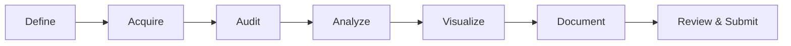

# 课程项目

<div class="dvam-lead" markdown>
课程项目要求团队围绕一个有研究意义的数据集完成分析与可视化，并以公开、可理解、可复现的方式交付过程与结果。
</div>

<div class="dvam-callout" markdown>
**核心交付**

研究问题 + 数据与许可说明 + 可运行代码 + 研究级图表 + 详细 README + 技术报告 + 已签署贡献表
</div>

## 基本要求

根据课程总结与仓库要求：

1. **选题**：主题可结合团队成员专业背景，但必须形成清晰的研究问题；
2. **团队**：每组最多 4 人；
3. **数据**：使用具有研究意义的数据集完成可视化与分析；
4. **文档**：详细 README 与技术报告为必交内容；
5. **展示**：用户友好的项目网站为可选加分型交付；
6. **贡献**：提交由全体成员确认并签字的贡献表；
7. **提交**：Fork 课程仓库，并通过 Pull Request 添加团队项目的外部仓库链接。

!!! important "完整性要求"
    未提交签署版贡献表时，项目材料不完整。贡献比例总和必须为 100%，每位成员应确认姓名、学号、具体贡献与比例。

## 从选题到交付



### 1. Define · 定义问题

- 用一句话说明研究对象、比较关系和预期产出；
- 明确每一行数据代表的分析单位；
- 区分探索性问题、解释性问题与预测性问题；
- 在开始建模前确定主要评价指标。

### 2. Acquire · 获取数据

- 记录数据来源、下载日期、版本与许可；
- 说明是否允许公开再分发；
- 大型数据使用下载脚本或稳定链接，不要直接堆入 Git；
- 含个人信息或受限信息的数据必须先完成脱敏与授权判断。

### 3. Audit · 审计质量

- 检查主键、重复、缺失、异常、单位与时间范围；
- 识别采样偏差、类别不平衡和潜在数据泄漏；
- 保存原始数据，所有清洗步骤应可由代码重建。

### 4. Analyze · 分析建模

- 先建立清晰的描述统计与基线；
- 方法复杂度应与样本规模、研究问题和团队能力匹配；
- 区分训练集、验证集与测试集；
- 记录随机种子、关键参数与软件版本。

### 5. Visualize · 视觉表达

- 每张主图只承担一个清晰任务；
- 坐标、单位、样本量、不确定性与图例完整；
- 颜色具有一致语义，并兼顾色觉差异；
- 图题描述发现，正文解释限制。

### 6. Document · 文档化

README 面向首次访问者，技术报告面向需要评估方法与结论的读者。两者应互补，而不是重复粘贴。

## 必交材料

| 交付物 | 最低要求 | 建议位置 |
| --- | --- | --- |
| README | 背景、问题、数据、方法、结果、复现步骤、成员信息 | 仓库根目录 |
| 技术报告 | 方法细节、结果解释、局限与参考文献 | `report/` |
| 源代码 | 能够从处理后数据重新生成主要结果 | `src/` / `notebooks/` |
| 图表 | 可读、命名稳定、与报告结论一致 | `figures/` |
| 环境说明 | Python / R 与核心依赖版本 | `environment.yml` / `requirements.txt` |
| 贡献表 | 全员填写、比例合计 100%、完成签署、PDF 格式 | 仓库根目录或 `report/` |
| 项目链接 | 在课程仓库 README 中添加团队外部仓库 | Pull Request |

## README 推荐结构

```markdown
# Project title

## Research question
## Data source and license
## Repository structure
## Methods
## Key findings
## Reproduction
## Limitations
## Team and contributions
## Citation and acknowledgements
```

!!! tip "复现步骤应可以直接执行"
    不要只写“安装相关依赖后运行代码”。请给出环境创建、数据获取、主入口运行与结果位置，并在一台干净环境或另一位组员的电脑上验证。

## 项目质量自检

### 研究与数据

- [ ] 研究问题可以被当前数据回答
- [ ] 数据来源、许可、版本和获取日期完整
- [ ] 原始数据与处理后数据边界清晰
- [ ] 缺失、异常与排除规则有记录

### 方法与结果

- [ ] 基线方法与主要指标明确
- [ ] 没有训练—测试数据泄漏
- [ ] 图表能够直接追溯到生成代码
- [ ] 结论没有超出数据和研究设计支持范围

### 工程与文档

- [ ] 新用户可按 README 重建主要结果
- [ ] 仓库中没有密码、Token、隐私数据或无关大文件
- [ ] 技术报告中的图表、数字与仓库一致
- [ ] 所有成员已确认贡献说明并签署贡献表

## 提交流程

1. Fork 课程官方仓库；
2. 在团队独立仓库完成项目与文档；
3. 修改课程仓库 README，在对应 Group ID 下添加项目名称、链接与成员；
4. 提交 Pull Request，并在描述中概括研究问题、交付物与团队信息；
5. 根据 review 意见修订，确认链接可访问、贡献表已提交。

## 学术诚信

贡献表中的声明要求成员确认提交内容为本人或团队真实完成，外部思想、文字、代码、数据和图形均得到适当引用。禁止抄袭、串通、伪造贡献或隐瞒来源。

使用生成式 AI 辅助代码、写作或图表时，应遵循课程最新规则，并对以下内容负责：

- 事实与引用是否准确；
- 代码是否真正运行并理解；
- 分析选择是否合理；
- 输出是否泄露受限数据；
- README 与报告是否如实说明工具使用。

## 课程材料

- [课程总结与 Final Project 说明](https://github.com/PKU-EMBL/Data-Visualization-and-Analysis-Methods/blob/main/DVAM_Dec_30_2025.pdf)
- [Final Project Group Signing Sheet](https://github.com/PKU-EMBL/Data-Visualization-and-Analysis-Methods/blob/main/DVAM_Contribution_Sheet.pdf)
- [课程官方仓库](https://github.com/PKU-EMBL/Data-Visualization-and-Analysis-Methods)

完成项目后，可参考 [学生作品归档](student-projects.md) 检查选题表达与仓库呈现。
