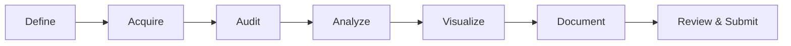

# Final Project

<div class="dvam-lead" markdown>
Teams investigate a meaningful question with a real dataset. They deliver an analysis and visualization that readers can understand and reproduce.
</div>

<div class="dvam-callout" markdown>
**Core deliverables**

Research question + data and license statement + runnable code + research-quality figures + detailed README + technical report + signed contribution form
</div>

## Basic Requirements

The project follows these requirements:

1. **Topic:** The topic may reflect team members' disciplinary backgrounds, but it must become a clear research question;
2. **Team:** No more than four students per group;
3. **Data:** Use a meaningful dataset for analysis and visualization;
4. **Documentation:** A detailed README and technical report are required;
5. **Showcase:** A user-friendly project website is optional and may earn additional credit;
6. **Contributions:** Submit a contribution form confirmed and signed by every member;
7. **Submission:** Fork the course repository and add the external team-repository link through a Pull Request.

!!! important "Completeness requirement"
    Without a signed contribution form, the project package is incomplete. Contribution percentages must sum to 100%. Each member must confirm their name, student ID, specific contributions, and percentage.

## From Topic to Delivery



### 1. Define the question

- State the research object, comparison, and expected output in one sentence;
- define the unit represented by each row;
- distinguish exploratory, explanatory, and predictive questions;
- choose the primary evaluation metric before modeling.

### 2. Acquire the data

- record source, download date, version, and license;
- state whether public redistribution is allowed;
- use a download script or stable link for large datasets instead of committing them to Git;
- complete a de-identification and authorization review before using personal or restricted data.

### 3. Audit quality

- check keys, duplicates, missingness, outliers, units, and time range;
- identify sampling bias, class imbalance, and potential leakage;
- preserve raw data and make every cleaning step reproducible from code.

### 4. Analyze and model

- establish clear descriptive statistics and a baseline first;
- match method complexity to sample size, question, and team capability;
- separate training, validation, and test data;
- record random seeds, key parameters, and software versions.

### 5. Visualize

- give each main figure one clear task;
- include axes, units, sample size, uncertainty, and legends;
- use color consistently and consider color-vision differences;
- write figure titles as findings and explain limitations in the text.

### 6. Document

The README is for first-time visitors. The technical report is for readers evaluating methods and conclusions. The two documents should complement one another rather than repeat the same text.

## Required Materials

| Deliverable | Minimum requirement | Suggested location |
| --- | --- | --- |
| README | Background, question, data, methods, results, reproduction steps, and team information | Repository root |
| Technical report | Method details, result interpretation, limitations, and references | `report/` |
| Source code | Able to regenerate the main results from processed data | `src/` / `notebooks/` |
| Figures | Readable, stably named, and consistent with report conclusions | `figures/` |
| Environment specification | Python / R and core dependency versions | `environment.yml` / `requirements.txt` |
| Contribution form | Completed by all members, percentages total 100%, signed, PDF format | Repository root or `report/` |
| Project link | Team external repository added to the course README | Pull Request |

## Recommended README Structure

```markdown
# Project title

## Research question
## Data source and license
## Repository structure
## Methods
## Key findings
## Reproduction
## Limitations
## Team and contributions
## Citation and acknowledgements
```

!!! tip "Reproduction steps should be executable"
    Do not write only “install the dependencies and run the code.” Give the environment-creation command, data-acquisition step, main entry point, and output location. Test the instructions in a clean environment or on another team member's computer.

## Project Quality Checklist

### Research and data

- [ ] The research question can be answered with the available data
- [ ] Source, license, version, and acquisition date are complete
- [ ] The boundary between raw and processed data is clear
- [ ] Missingness, outliers, and exclusion rules are recorded

### Methods and results

- [ ] The baseline method and primary metrics are explicit
- [ ] There is no train–test data leakage
- [ ] Figures can be traced directly to generation code
- [ ] Conclusions do not exceed the support of the data and design

### Engineering and documentation

- [ ] A new user can reproduce the main result from the README
- [ ] The repository contains no passwords, tokens, private data, or unrelated large files
- [ ] Figures and numbers in the report match the repository
- [ ] Every member has confirmed and signed the contribution statement

## Submission Workflow

1. Fork the official course repository;
2. complete the project and documentation in the team's independent repository;
3. edit the course README and add the project title, link, and members under the appropriate Group ID;
4. submit a Pull Request summarizing the research question, deliverables, and team information;
5. revise after review and confirm that the link is accessible and the signed contribution form is present.

## Academic Integrity

The contribution statement asks members to confirm that the submission was completed by the team, and that external ideas, text, code, data, and figures are properly cited. Plagiarism, collusion, fabricated contributions, and concealed sources are prohibited.

When using generative AI to assist with code, writing, or figures, follow the latest course rules and take responsibility for:

- factual and citation accuracy;
- code that actually runs and is understood by the team;
- reasonable analytical choices;
- avoiding disclosure of restricted data;
- honest disclosure of tool use in the README and report.

## Course Materials

- [Course homepage](index.md)
- [Resource Index](api/index.md)
- [Official course repository](https://github.com/PKU-EMBL/Methodologies-of-Data-Visualization-and-Analysis)
