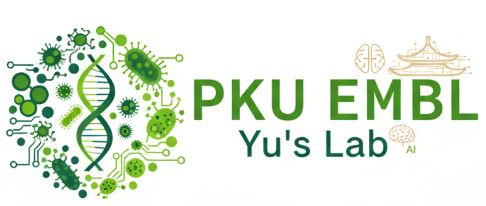

---
hide:
  - toc
---

# Data Visualization & Analysis Methods

<section class="dvam-hero" markdown>

PKU EMBL · Course Documentation

## 从数据到证据，从图形到洞见

本课程以 **Python + R** 为主要技术栈，围绕数据整理、视觉编码、统计分析、可复现工作流与研究型项目展开。目标不是“画出一张图”，而是建立一套能够解释问题、检验假设并清晰传达证据的方法体系。

[开始学习](Prerequisites_guild.md){ .md-button .md-button--primary }
[查看课程项目](final-project.md){ .md-button }

<aside class="dvam-hero__panel" markdown>
**课程概览**

- 面向对象：数据分析与生命科学方向学习者
- 课程学期：2025–2026 Fall
- 核心工具：Python、R、Jupyter、Positron
- 学习方式：概念讲解、代码实践、团队项目
- 维护方式：GitHub Issues / Pull Request
</aside>
</section>

**5**

核心能力模块

**Python + R**

双语言分析工作流

**17**

学生项目归档

## 课程定位

数据可视化是分析过程的一部分，而不是分析结束后的装饰。本课程强调从研究问题出发，形成“数据—方法—证据—叙事”的完整链路：

### 数据素养

识别变量类型、缺失模式、测量尺度与潜在偏差；理解一张图背后的数据生成过程。

### 视觉推理

根据比较、分布、关系、组成与时序等任务选择合适的视觉编码，避免误导性表达。

### 分析方法

从描述统计延伸到机器学习与深度学习，理解方法假设、评价指标和结论边界。

### 可复现实践

使用隔离环境、版本控制、脚本化分析和清晰文档，让结果能够被复核、复用和扩展。

## 学习路线

| 阶段 | 核心问题 | 推荐入口 | 阶段产出 |
| --- | --- | --- | --- |
| 01 · 环境准备 | 如何建立稳定、隔离、可复现的工作环境？ | [环境准备](Prerequisites_guild.md) | 可运行的 Python / R 环境 |
| 02 · 分析基础 | 如何把原始数据转化为可信证据？ | [Lecture 01](lecture1.md) | 数据审计与基础可视化 |
| 03 · 跨语言协作 | 如何组合 Python 与 R 的生态优势？ | [Lecture 02](lecture2.md) | 可复用的跨语言分析流程 |
| 04 · 研究实践 | 如何从问题定义推进到公开交付？ | [项目要求](final-project.md) | README、技术报告与项目仓库 |
| 05 · 复盘迁移 | 如何从优秀案例中抽象方法？ | [学生作品](student-projects.md) | 项目评审与改进清单 |

## 文档导航

### [环境准备](Prerequisites_guild.md)

Windows / macOS / Linux 配置建议、Conda 环境、Positron 与常见问题。

### [课程讲义](lecture1.md)

从研究问题、数据结构与视觉编码开始，逐步建立分析框架。

### [课程项目](final-project.md)

团队规模、选题、交付物、提交流程、贡献表与学术诚信要求。

### [学生作品](student-projects.md)

2025–2026 学期 17 个团队项目的主题与公开仓库。

### [资源索引](api/index.md)

按任务整理的官方工具文档、数据资源与项目自检清单。

### [更新日志](Release_notes.md)

追踪文档结构、内容与视觉系统的重要变化。

!!! note "文档边界"
    本站是课程学习与项目协作入口。软件版本、外部数据集与平台规则可能变化，执行关键操作前请以对应官方文档为准。课程考核与学术诚信要求以任课教师发布的最新通知为准。

## 联系与贡献

- 课程与文档维护：Zhaorui(Elijah) JIANG
- Email：[zrjiang25@stu.pku.edu.cn](mailto:zrjiang25@stu.pku.edu.cn)
- 反馈与修订：[GitHub Issues](https://github.com/PKU-EMBL/Data-Visualization-and-Analysis-Methods/issues)
- 内容贡献：Fork 仓库后提交 Pull Request，并说明修改范围与信息来源。
