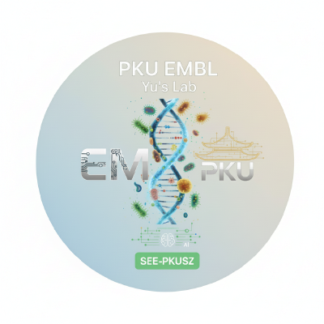

# Methodologies of Data Visualization and Analysis

> From data to evidence and from figures to insight: a methods course in reproducible analysis and research-oriented visual communication.

<p align="center">
  
</p>

<p align="center">
  <strong>PKU EMBL · Course Documentation · Fall 2026–2027</strong>
</p>

This repository contains the current English documentation for **Methodologies of Data Visualization and Analysis** at PKU EMBL. The course introduces research-oriented visualization, statistical analysis, reproducible workflows, and Vibe Coding with Python and R.

## Course information

| Item | Information |
| --- | --- |
| Course code | 04713232 |
| Instructor | Ke Yu |
| Course type | Graduate course |
| Classroom | C303 |
| Meeting time | Tuesday, 08:30–11:30 |
| Enrollment cap | 80 students |

## Course Overview

**Fall 2026–2027**

This graduate course introduces practical methods for data visualization and analysis. Students learn to turn research questions into clear workflows, choose appropriate visual and statistical methods, and communicate reproducible results with Python and R.

A central theme is **Vibe Coding**: using AI coding assistants to prototype and debug workflows while checking outputs with human judgment, version control, and transparent disclosure. Students apply these methods in an original team project.

## Course Staff

- Instructor: [Ke Yu](https://see.pkusz.edu.cn/info/1012/1454.htm) · [yuke.sz@pku.edu.cn](mailto:yuke.sz@pku.edu.cn)
- Course Assistant: [Zhaorui Jiang](https://zhaorui-bi.github.io/)

## Logistics

This is a **graduate-level course** taught by **Ke Yu**. It meets every **Tuesday, 08:30–11:30**, in **C303** during **Fall 2026–2027**, with an enrollment cap of **80 students**.

## Schedule

The homepage organizes the schedule as **Date · Description · Reading Material · Deadlines**. Reading Material and Deadlines are currently left blank and will be updated when the course information is released.

## Documentation

- [Course homepage](DVAM_Guide/docs/index.md)
- [Prerequisites](DVAM_Guide/docs/Prerequisites_guild.md)
- [Lecture 01 · From Data to Evidence](DVAM_Guide/docs/lecture1.md)
- [Lecture 02 · Cross-language Workflow](DVAM_Guide/docs/lecture2.md)
- [Final Project requirements](DVAM_Guide/docs/final-project.md)
- [Resource Index](DVAM_Guide/docs/api/index.md)

The documentation is built with MkDocs Material and configured for Read the Docs.

## Final Project

The course project turns a topic in the team's disciplinary background into a clear research question, reproducible analysis, and documented visual communication. See the [Final Project requirements](DVAM_Guide/docs/final-project.md) for the current workflow and submission checklist.

## Contributing

1. Fork this repository;
2. create a focused branch for a documentation update;
3. submit a Pull Request with a concise description of the change.

For documentation problems, open a [GitHub Issue](https://github.com/PKU-EMBL/Methodologies-of-Data-Visualization-and-Analysis/issues).

## Citation

```bibtex
@misc{PKU_EMBL_Methodologies_2026,
  author       = {{PKU-EMBL}},
  title        = {Methodologies of Data Visualization and Analysis},
  year         = {2026},
  publisher    = {GitHub},
  howpublished = {\url{https://github.com/PKU-EMBL/Methodologies-of-Data-Visualization-and-Analysis}}
}
```

## License

See [LICENSE](LICENSE) for details.
